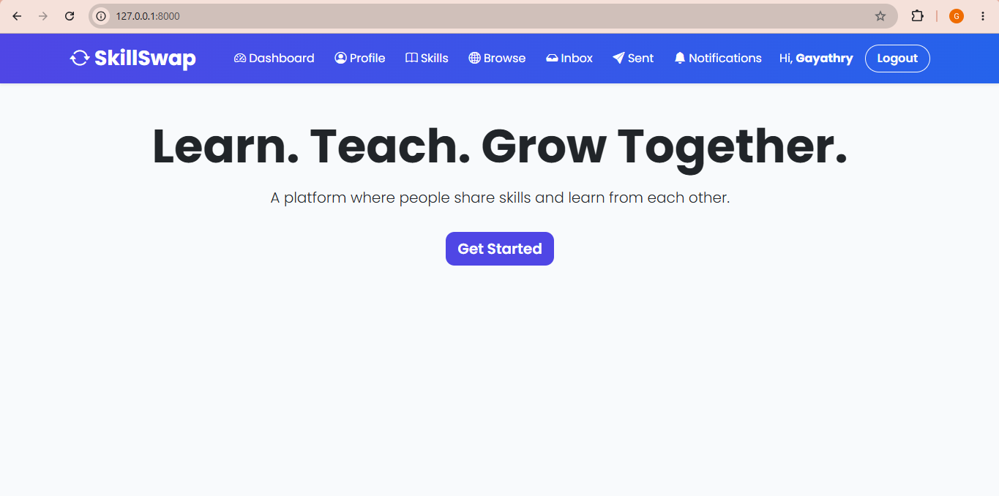
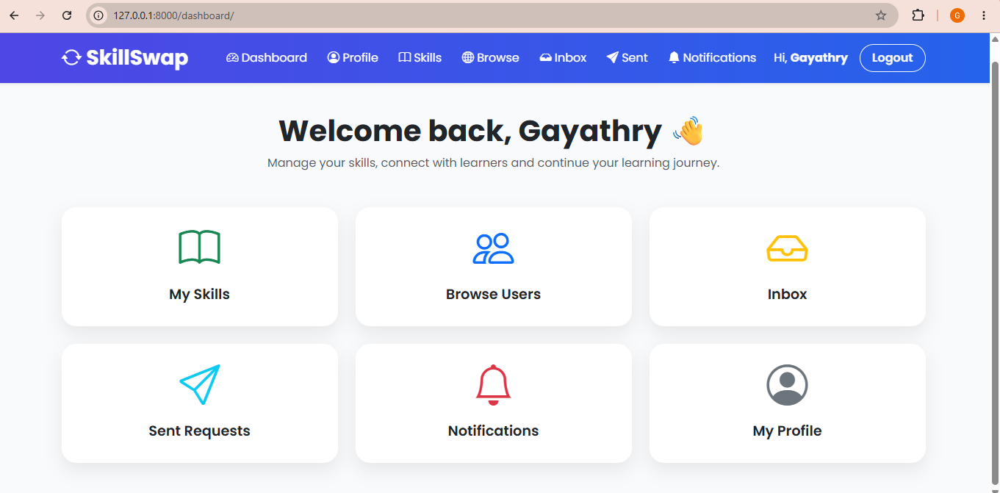
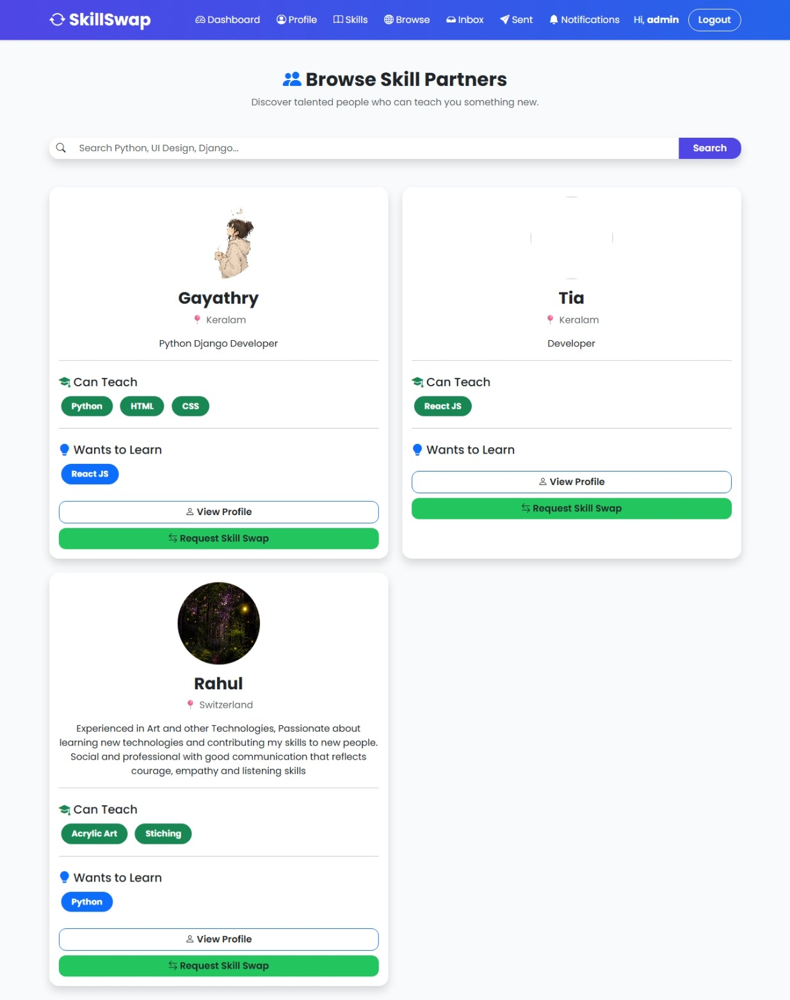
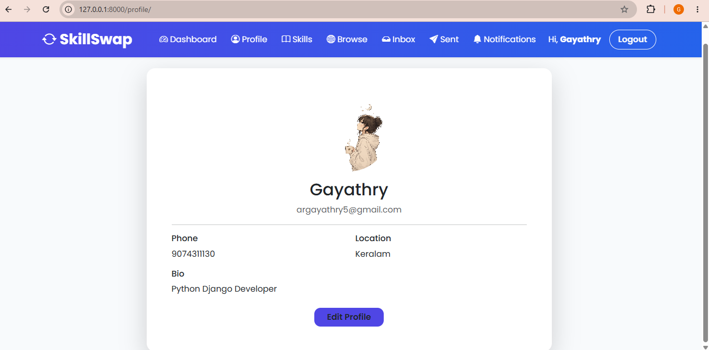
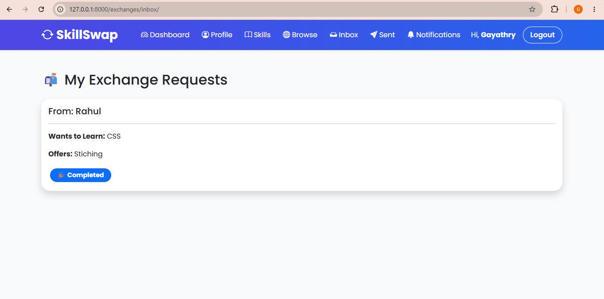
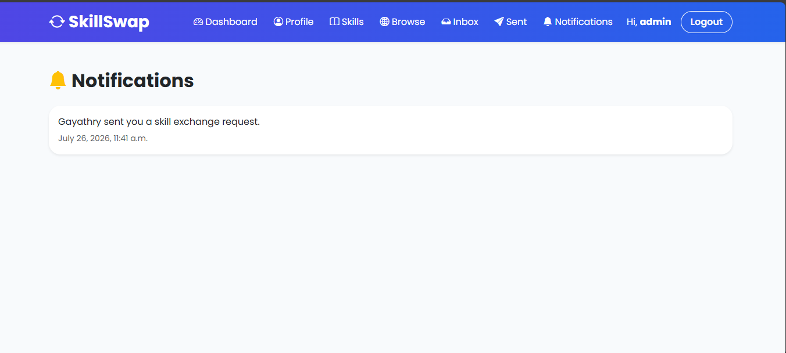

# SkillSwap 🔄

SkillSwap is a Django-based platform where users can share skills, learn from others, and connect through skill exchange.

## 🚀 Features

- User registration with OTP verification
- User profiles
- Add and manage skills
- Browse users based on skills
- Send skill exchange requests
- Accept/reject exchange requests
- Notifications
- User reviews and ratings

## 🛠️ Technologies Used

### Backend
- Python
- Django

### Frontend
- HTML
- CSS
- Bootstrap

### Database
- SQLite

## 📌 Project Structure

- accounts - Authentication and user management
- profiles - User profiles
- skillapp - Skill management
- exchanges - Skill exchange requests
- notifications - User notifications
- reviews - Rating and feedback system


## Screenshots

### Home Page


### Dashboard


### Browse Users


### Profile


### Inbox


### Notifications



## ⚙️ Installation

Clone the repository:

```bash
git clone https://github.com/Gayathryyy/SkillSwap.git

